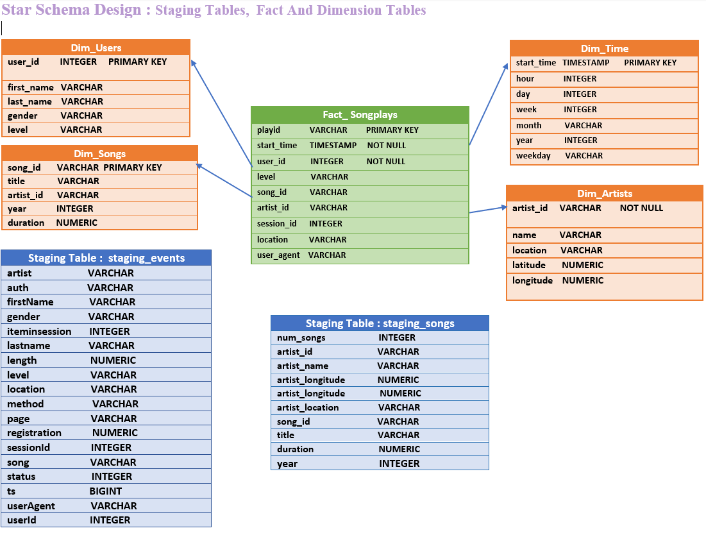
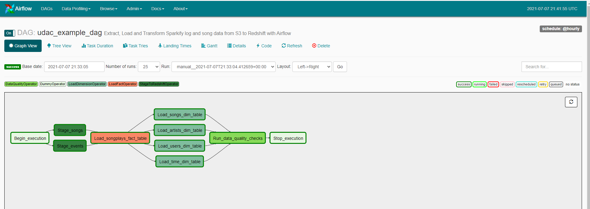

# Project : Data Pipelines

## Author
Diana Aranha

## Purpose:
To enable Sparkify analytics team to continue finding insights in what songs their users are  
listening to using more automation and monitoring.
   
## Current Scenario:
A music startup named Sparkify to introduce more automation and monitoring to their data warehouse  ETL pipelines with Apache Airflow. 
* The source data resides in S3 and needs to be processed in Sparkify's data warehouse in Amazon  Redshift 
* The source datasets consist of JSON logs that tell about user activity in the application and  
JSON metadata about the songs the users listen to. 

## Data Engineer Tasks:
1. Create high grade data pipelines that :
   a. are dynamic and  
   b. built from reusable tasks,  
   c. can be monitored, and  
   d. can allow easy backfills  
2. Run tests for data quality against Sparkify datasets after the ETL steps have been executed 
   to catch any discrepancies in the datasets. 

### Schema Design from Project 3

## Project Datasets
| Data               | Location                     | File Path                        |
|--------------------|------------------------------|----------------------------------|
| Song Data          | s3://udacity-dend/song_data  | s3://udacity-dend/song_data/A/A/A |
| Log Data           | s3://udacity-dend/log_data   | s3://udacity-dend/log_json_path.json |

### Song Dataset
1. This dataset is a subset of real data from the **Million Song Dataset**
2. Each file is in JSON format and contains metadata about a song and the artist of that song. 
3. The files are partitioned by the first three letters of each song's track ID. 
   Filepaths for two files in this dataset are as follows: 
   * **song_data/A/B/C/TRABCEI128F424C983.json**
   * **song_data/A/A/B/TRAABJL12903CDCF1A.json**
   
#### Song file Example : **TRAABJL12903CDCF1A.json**

### Log Dataset
1. The log dataset consists of log files in JSON format generated by an event simulator 
   based on songs in the dataset above. 
   
   **{ 
    "num_songs": 1,  
    "artist_id": "ARJIE2Y1187B994AB7",  
    "artist_latitude": null,  
    "artist_longitude": null,  
    "artist_location": "",  
    "artist_name": "Line Renaud",  
    "song_id": "SOUPIRU12A6D4FA1E1",  
    "title": "Der Kleine Dompfaff",  
    "duration": 152.92036,  
    "year": 0  
   }**
   
#### Log file Example : log_data/2018/11/2018-12-events.json

### Configuring the DAG
1. Setting up Default Parameters 
   a. The DAG does not have dependencies on past runs 
   b. The tasks are retried 3 times in the event of failure 
   c. Retries occur every 5 minutes 
   d. Catchup is turned off 
   e. No email on retry 
   
### Customizing Operators
There are four operators to:
* stage the data
* transform the data
* run checks on data quality

| Operator                   | Tables          | Purpose 
|----------------------------|-----------------|---------------------------------------|
| A. StageToRedshiftOperator | Staging Events  | 1. Loads staging_events and staging_songs |
|                            | Staging Songs   |  tables |
|                            |                 | 2. Connects with redshift through the PostgresHook |
|           |  | 3. Uses AWS credentials : secret key and access key associated with the IAM role | 
|                            |                 | 4. Staging Events is :  |
|                            |                 | loaded from s3://udacity-dend/log_data |
|                            |                 | with file path s3://udacity-dend/log_json_path.json |
|                            |                 | 5. Staging Songs is loaded from : |
|                            |                 | s3://udacity-dend/song_data/A/A/A  |
|                            |                 | and is Formatted as JSON auto |
|                            |                 |        |
| B. LoadFactOperator        |  songplays      | B.1 Loads the fact table : songplays  | 
|                            |                 |  from staging_events and staging_songs|
|                            |                 |                                       |
| C. LoadDimensionOperator   | artists         | C.0 Loads the dimension tables:       |
|                            | users2          | C.1 Loads artists from staging_songs  |
|                            | songs           | C.2 Loads users2 from staging_events  |
|                            | time            | C.3 Loads songs from staging_songs    |
|                            |                 | C.4 Loads time from songplays |
|                            |                 |                                       |
| D. DataQualityOperator     | songplays       | D.1 Checks if playid column of songplays is null |
|                            | songs           | D.2 Checks if songid column of table songs is null |
|                            | artists       | D.3 Checks if artistid column of table artists is null |
|                            | users2        | D.3 Checks if userid column of table users2 is null |
|                            | time          | D.4 Checks if start_time column of table time is null |

### Implement the DAG

#### Supporting Files for Schema and Loading files  
| Files                | Location | Purpose                              |
|----------------------|----------|--------------------------------------|
| 1. create_tables.py | airflow  | contains 7 create statements for:    |
|                      |          | staging tables - staging_events, staging_songs |
|                      |          | fact table -  songplays |
|                      |          | dimension tables - songs, users, artists, time |
|                      |          |    |
| 2. sql_queries      | airflow/plugins/helpers | contains insert statements for the fact |
|                      |                         | and dimension tables |

#### Create an IAM Role for the Redshift Warehouse with S3 ReadOnly Permissions
Please refer to project 3 -- the datawarehouse project on github regarding AWS redshift which  
involved creating an IAM role, permissions, readonlyaccess for S3 datasets, attaching a policy  
for the data warehouse role.  This is done programatically using Jupyter notebook 
https://github.com/daranha1/DataEng-Data-Warehouse

#### Create a cluster on AWS Redshift 
**Please note: The us-west-2 region is used for the redshift cluster as the raw datasets in AWS S3
are located in the us-west-2 region** 
A. Before running the DAG, Create an AWS Redshift Cluster using a free trial option 
B. Add a database username and password 
B. Render the cluster publicly accessible using your IP address 
   such as 0.0.0.0/0  (this ip address is for testing but not for production) 
C. Associate an IAM role with the cluster  
D. Create seven tables in Redshift using the redshift console 
   staging_events, staging_songs, songplays, artists, users, songs, time as per the 
   Sparkify schema - see above image 
   D1. Copy the tables creation statements from DataEng-Data-Pipelines/airflow/create_tables.py  into the query editor, on the Redshift console. 
   D2. Connect to the newly created database and Click the run button to create the tables. 
** **Note: Redshift loads a sample database with a users table.** 
** So the **users** table in Sparkify was renamed to **users2**

### Create Connection for AWS Credentials and Redshift in Airflow UI

| Connection | AWS Credentials     |  Redshift     | Files |
|------------|---------------------|---------------|-------|
| Conn ID    | aws_credentials     | redshift      | 1. aws_credentials.PNG |
|            |                     |               | 2. redshift.PNG
| Conn Type  | Amazon Web Services | Postgres      |
| Host       | NA                  | cluster endpoint |redshift-cluster-endpoint.PNG|
| Schema     | NA                  | dev             |
| Login      | AKIAXXXXXX          | awsuser         |
| Password   | XXXXXXXXXX          | XXXXXXXXXX      |
| Port       | NA                  | 5439            |

** **NA = Not Applicable** 
** **Access Key ID and Secret assess key associated with IAM User for redshift datawarehouse role**
   **and S3 read only permissions** 
** **cluster endpoint example: redshift-cluster-1.cro51qt0mnmx.us-west-2.redshift.amazonaws.com** 
** **database password when database was created at time of cluster creation** 
** **Files in DataEng-Data-Pipelines/images/airflow-connections/**

### Running the DAG
1. Use the Udacity workspace using the command: /opt/airflow/start.sh
2. Click the blue button to Access Airflow once the airflow webserver is ready
3. Create the Airflow Connections above if not already setup
4. Trigger the DAG and check the DAG View and Tree View
5. Dag Files in DataEng-Data-Pipelines/images/dags

### DAG Results

#### Graph View of DAG Run

#### Tasks - Execution Times and Log Files
| Task_ID         | Start_time          | End_time             | File  |
|-----------------|---------------------|----------------------|--------|
| 1. Begin_execution | 2021-07-07 21:33:04 | 2021-07-07 21:33:15  | Log-Begin-Execution |
| 2a. Stage_songs     | 2021-07-07 21:33:27 | 2021-07-07 21:33:30  | Log-Stage-Songs |
| 2b. Stage_events    | 2021-07-07 21:33:21 | 2021-07-07 21:33:35  | Log-Stage-Events |
| 3. Load_songplays_fact_table | 2021-07-07 21:33:35 | 2021-07-07 21:33:40 | Log-Load-Songplays|
| 4a. Load_songs_dim_table     | 2021-07-07 21:33:52 | 2021-07-07 21:34:07 | Log-Load-Songs |
| 4b. Load_artists_dim_table   | 2021-07-07 21:33:52 | 2021-07-07 21:34:07 | Log-Load-Dim-Artists |
| 4c. Load_users_dim_table     | 2021-07-07 21:33:52 | 2021-07-07 21:34:07 | Log-Load-Dim-Users|
| 4d. Load_time_dim_table      | 2021-07-07 21:33:52 |2021-07-07 21:34:07  | Log-Load-Dim-Time |
| 5. Run_data_quality_checks   | 2021-07-07 21:34:10 | 2021-07-07 21:34:20 | Load-Data-Quality |
| 6. Stop_execution            | 2021-07-07 21:34:21 | 2021-07-07 21:34:26 | Log-Stop-Execution |

** **Files in DataEng-Data-Pipelines/Logs**

#### Tables, Row Counts and Data Quality Tests

| Table     | Row Count | Data Quality Check | Data Quality Test Status | Files |
|-----------|-----------|--------------------|--------------------------|-------|
| A. Staging_Events | 8056 | NA  | NA | A1. staging-events-count-8056.PNG |
| B. Staging_Songs  | 24   | NA  | NA | B1. staging-songs-count-24.PNG |
| C. Songplays | 6820 | playid null ? | expected = actual = 0  - Passed | C1.songplays-count-6820.PNG |
|              |      |                |  | C2. songplays-data-quality.PNG |
| D. Artists   | 24   | artistid null ? | expected = actual = 0 - Passed | D1.artists-count-24.PNG |
|              |      |               |  | D2. artists-data-quality.PNG |
| E. Users     | 104  | userid null ? | expected = actual = 0 - Passed | E1. users-count-104.PNG |
|              |      |              |  | E2. users2-data-quality.PNG |
| F. Songs     | 6820 | songid null ? | expected = actual = 0 - Passed | F1. songs-count.PNG |
|              |      |               |   | F2. songs-data-quality.PNG |
| G. Time      | 6820 | start_time null ? | expected = actual = 0 - Passed |G1. time-count-6820.PNG |
|              |      |                   |  | G2. time-data-quality.PNG |

** **NA  Not Applicable** 
** **Query Count Files located in DataEng-Data-Pipelines/images/table-loading-counts**  
** **Data Quality files located in DataEng-Data-Pipelines/data-quality** 

#### Delete the Redshift Cluster at the console to manage costs

 